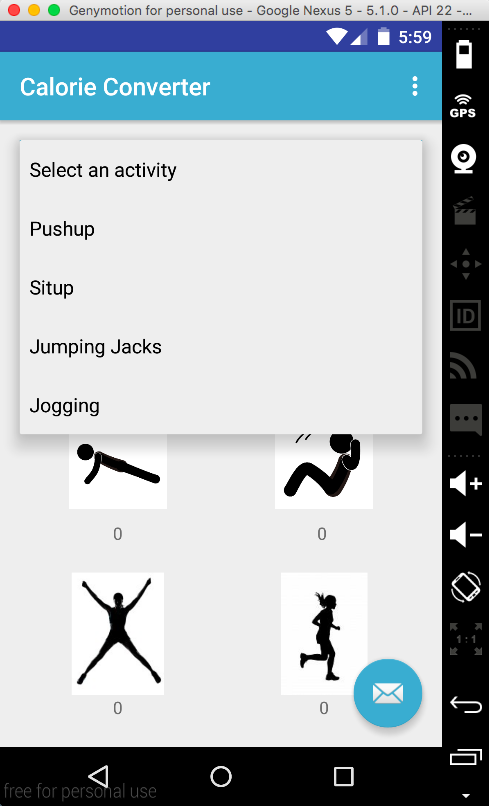
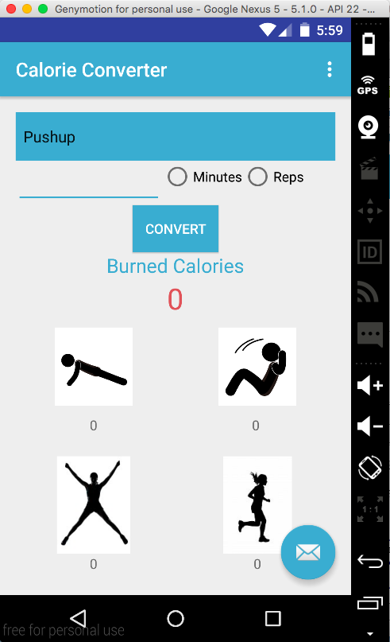
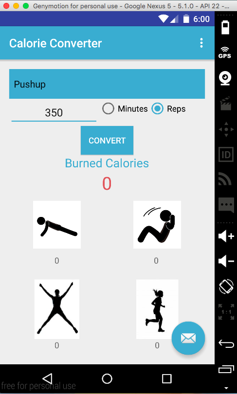
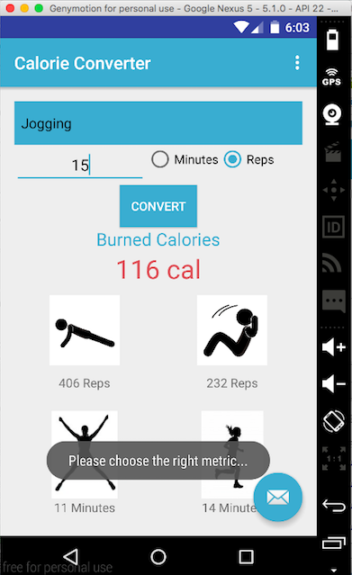
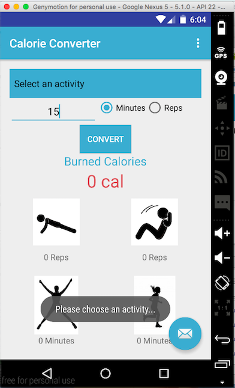
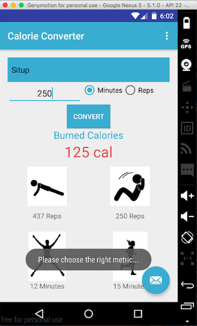

# PROG 01: Crunch Time

## Project: Calorie Converter
Nowadays, along with the development of technology, people get more attention to health. There are many available tools to help us keep track of our health like Fitbit, My Fitness app, etc. The Calorie Converter app is inspired by those apps. This app helps users convert from the amount of exercise in a specific activity to burned calories. Besides, it also displays the equivalent amount of another type of exercise. In this app, there are 4 types of exercises: pushup, situp, jumping jacks, and jogging. Pushup and situp are measured in repetitions while jumping jacks and jogging are measured in minutes. The standout point of Calorie Converter is that it suggests users do other exercises to burn the same amount of calories without repeating the same type of activity over and over again.

## Authors

Nhi Tran ([nhitran2610@berkeley.edu](mailto:nhitran2610@berkeley.edu))

## Demo Video

See [my demo video here] (https://www.youtube.com/watch?v=7Moxr_CStEs&feature=youtu.be)

## Screenshots

## Acknowledgments

* RadioGroup tool reference: http://www.mkyong.com/android/android-radio-buttons-example/
* Color Code reference: https://teamtreehouse.com/library/build-a-simple-android-app-2014/creating-the-screen-layout/setting-colors

